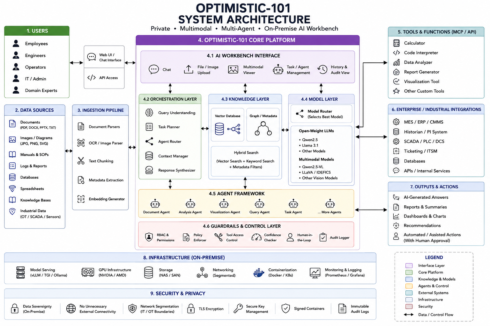

# Optimistic-101: Project Report

## 1. Abstract

Optimistic-101 is a proposed private and secure Large Language Model (LLM) framework designed for organizations that need to use artificial intelligence while maintaining control over confidential information.

The proposed system focuses on deploying open-weight multimodal LLMs and supporting AI services within an organization's controlled infrastructure. The architecture combines knowledge retrieval, multimodal processing, agent-based task orchestration, verified tool interactions, security guardrails, human approval, and audit logging.

The core objective is to enable AI-assisted organizational and industrial workflows without requiring confidential operational data to leave the controlled environment.

**Current Status:** Proposed architecture and research documentation phase.

---

## 2. Introduction

Large Language Models have created new opportunities for organizations to improve information access, automate repetitive tasks, and support decision-making.

However, many organizations handle confidential documents, proprietary knowledge, operational information, and sensitive industrial data. In such environments, unrestricted use of external cloud-based AI services may raise concerns related to privacy, data sovereignty, security, and organizational control.

Optimistic-101 proposes a private AI architecture in which models and supporting services can operate within controlled infrastructure.

The proposed principle is:

> The model moves to the data instead of confidential data moving outside the organization.

---

## 3. Problem Statement

Organizations need intelligent AI systems capable of understanding documents and other organizational data while maintaining strong control over confidential information.

Key challenges include:

- Protecting confidential organizational data
- Maintaining data sovereignty
- Supporting restricted or air-gapped environments
- Reducing dependency on external AI services
- Preventing unreliable AI outputs in critical workflows
- Integrating AI with existing organizational systems
- Maintaining accountability through logging and human oversight

---

## 4. Proposed Solution

Optimistic-101 proposes a private, on-premise AI framework built around open-weight language models.

The proposed system combines:

- Private LLM deployment
- Retrieval-Augmented Generation (RAG)
- Multimodal data processing
- AI agent orchestration
- Security and policy guardrails
- Verified tool interactions
- Human-in-the-loop approval
- Audit logging

The architecture is intended to support organizations where confidentiality and operational control are important.

---

## 5. Objectives

The major objectives of Optimistic-101 are:

1. To explore private deployment of Large Language Models.
2. To support organizational knowledge retrieval using RAG.
3. To enable multimodal processing of text, images, audio, and time-series data.
4. To support agent-based task planning and routing.
5. To maintain security through controlled access and policy enforcement.
6. To include human approval for critical or low-confidence actions.
7. To provide traceability through audit mechanisms.
8. To support future deployment in restricted or air-gapped environments.

---

## 6. Proposed System Architecture

The proposed workflow is:

```text
USER QUERY
    ↓
MULTIMODAL INPUT
Text • Documents • Images • Audio • Sensor Data
    ↓
KNOWLEDGE CORE
RAG • Vector Database • Organizational Knowledge
    ↓
LLM AND AGENT ORCHESTRATOR
Planning • Routing • Task Coordination
    ↓
POLICY AND SECURITY GUARDRAILS
Confidence • Permissions • Approvals
    ↓
VERIFIED TOOLS AND SYSTEMS
Organizational Applications and Data Systems
    ↓
HUMAN APPROVAL
For Critical or Low-Confidence Actions
    ↓
AUDITED OUTPUT
Logs • Explanation • Traceability
### System Architecture Diagram




## 7. Major Components

### 7.1 Model Layer

The model layer is the core AI component of Optimistic-101.

The proposed system may use open-weight Large Language Models (LLMs) and multimodal models that can operate within an organization's controlled infrastructure.

Key considerations include:

- Local or on-premise model deployment
- Open-weight models
- Quantization for efficient deployment
- Hardware-aware model selection
- Offline model management where required

The goal is to support AI capabilities while maintaining organizational control over confidential data.

---

### 7.2 Knowledge Retrieval

The knowledge retrieval component helps the AI access relevant information from organizational documents and internal knowledge sources.

The proposed approach uses Retrieval-Augmented Generation (RAG).

The process may include:

- Document ingestion
- Document processing
- Text chunking
- Embedding generation
- Vector database storage
- Relevant information retrieval

This helps provide context to the language model when answering queries.

---

### 7.3 Agent Orchestration

Agent orchestration is responsible for managing complex tasks that may require multiple steps.

The proposed agent system may:

- Understand user intent
- Plan tasks
- Route requests
- Coordinate specialized agents
- Request appropriate tools
- Apply policies before actions

The architecture proposes a supervisor or orchestrator that coordinates different agents depending on the task.

---

### 7.4 Multimodal Processing

Organizations may use different types of data.

The proposed architecture can support:

- Text
- Documents
- Images
- Audio
- Sensor or time-series data

Multimodal processing can help combine information from different organizational data sources within a unified AI workflow.

---

### 7.5 Security and Guardrails

Security and guardrails are essential components of the proposed system.

The architecture considers:

- Role-Based Access Control (RBAC)
- Policy-based authorization
- Network segmentation
- Controlled external connectivity
- Encryption
- Secure key management
- Audit logging
- Human approval for critical actions

Low-confidence, safety-critical, or out-of-scope actions should be escalated for human review.

The proposed principle is that deterministic systems should compute and verify where possible, while AI agents assist with planning and explanation.

## 8. Proposed Technology Stack

The following technologies are proposed as possible components of the Optimistic-101 architecture. The final technology choices may change during implementation.

| Component | Proposed Technology |
|---|---|
| AI Models | Open-weight Large Language Models |
| Multimodal Models | Open-weight multimodal models |
| Model Serving | vLLM |
| Backend | FastAPI |
| Agent Orchestration | LangGraph |
| Frontend | React |
| Relational Database | PostgreSQL |
| Vector Search | pgvector |
| Cache | Redis |
| Messaging | Kafka / MQTT |
| Industrial Communication | OPC-UA |
| Object Storage | S3-compatible storage |

These technologies support the proposed model, orchestration, data, and security architecture described in the project presentation.

## 9. Implementation Methodology

The proposed implementation of Optimistic-101 follows a phased approach. This allows the system to be developed and evaluated gradually.

### Phase 1: Research and Architecture

The initial phase focuses on:

- Understanding the problem requirements
- Studying private and on-premise AI deployment
- Designing the proposed system architecture
- Identifying security and privacy requirements
- Reviewing suitable open-weight models and supporting technologies

### Phase 2: Unit Pilot

The project presentation proposes starting with a focused pilot use case.

Possible activities include:

- Selecting a limited organizational or industrial use case
- Preparing relevant documents and knowledge sources
- Implementing basic knowledge retrieval
- Evaluating the usefulness of AI-assisted responses

### Phase 3: Multi-Agent Development

The next phase can introduce multiple specialized agents.

The proposed approach includes:

- Task planning
- Agent routing
- Specialized organizational or industrial functions
- Controlled tool interactions

### Phase 4: Security and Human Oversight

This phase focuses on improving trust and control through:

- Role-Based Access Control
- Policy enforcement
- Confidence checks
- Audit logging
- Human approval for critical actions

### Phase 5: Wider Deployment

The long-term proposed approach can expand from a limited pilot toward wider organizational deployment.

Potential activities include:

- Supporting additional workflows
- Scaling infrastructure
- Evaluating multiple deployment environments
- Improving model routing and efficiency
- Extending multimodal capabilities

The overall methodology follows a gradual progression from a focused pilot to broader deployment and future scaling.

## 10. Security and Privacy Considerations

Security and privacy are central considerations in the proposed Optimistic-101 architecture.

### 10.1 Data Sovereignty

The proposed system is designed to support deployment within controlled organizational infrastructure.

The objective is to ensure that confidential organizational and industrial data remains within the defined operational boundary.

The proposed architecture considers:

- On-premise deployment
- Restricted external connectivity
- Air-gap-ready operation where required
- No unnecessary external data transfer

### 10.2 Access Control

The proposed architecture considers Role-Based Access Control (RBAC).

Access controls can help define:

- Which users can access specific information
- Which actions users are permitted to perform
- Which tools or systems AI agents can access

### 10.3 Policy Enforcement

Policies can be used to control AI and agent behavior.

The proposed framework considers policy mechanisms for:

- Permission validation
- Tool access control
- Restricted actions
- Approval requirements

### 10.4 Network Security

The proposed technical approach considers security boundaries between different systems.

Potential measures include:

- Network segmentation
- Controlled OT/IT communication
- Unidirectional gateways where appropriate
- Blocked external connectivity

### 10.5 Secure Infrastructure

The project presentation proposes additional trust and security measures such as:

- TLS for secure communication
- Secure key management
- Signed containers
- Immutable audit logs

### 10.6 Human-in-the-Loop

Human oversight is proposed for situations involving:

- Low-confidence outputs
- Safety-critical actions
- Out-of-scope requests
- Actions requiring organizational approval

This approach helps ensure that AI systems assist human decision-making rather than independently performing uncontrolled critical actions.

## 11. Feasibility and Viability

### 11.1 Technical Feasibility

The proposed architecture is based on existing technologies such as open-weight LLMs, multimodal models, vector databases, Retrieval-Augmented Generation, agent orchestration frameworks, and local model-serving systems.

The modular design allows the system to be developed gradually, starting with a limited pilot before expanding to broader organizational use.

Techniques such as model quantization and model routing may help optimize hardware usage.

### 11.2 Deployment Feasibility

The proposed system can be designed for deployment within controlled organizational infrastructure.

The project presentation considers a gradual approach:

- Unit-level pilot
- Multi-agent deployment
- Wider organizational or plant-level rollout
- Future multi-location deployment

The exact infrastructure requirements will depend on the selected models, workload, number of users, and required multimodal capabilities.

### 11.3 Viability

The proposed approach may be valuable for organizations that require:

- Greater control over confidential data
- Private AI infrastructure
- Reduced dependency on external AI services
- Reusable AI capabilities across multiple workflows

Actual technical and economic viability will require validation through future implementation and evaluation.

## 12. Potential Challenges and Mitigation

### 12.1 Hallucination and Unreliable Outputs

LLMs may generate incorrect or unsupported information.

**Proposed mitigation:**

- Ground responses using relevant retrieved information
- Use verified tools for calculations or system data where applicable
- Apply confidence checks
- Require human approval for critical actions

### 12.2 Limited Organization-Specific Data

The available internal knowledge base may initially be incomplete.

**Proposed mitigation:**

- Start with available documents and knowledge sources
- Use RAG and few-shot approaches
- Collect controlled user feedback
- Consider fine-tuning in future stages where appropriate

### 12.3 Hardware Cost and Availability

Large AI models may require significant computing resources.

**Proposed mitigation:**

- Route routine tasks to smaller models
- Use model quantization
- Optimize model serving
- Consider fallback approaches where suitable

### 12.4 Security Boundaries

Connecting AI systems with internal organizational or industrial systems requires careful control.

**Proposed mitigation:**

- Apply network segmentation
- Enforce policies and permissions
- Restrict tool access
- Block unnecessary external connectivity

### 12.5 Model Updates in Restricted Environments

Updating models in air-gapped or restricted environments may be challenging.

**Proposed mitigation:**

- Use signed offline model and container bundles
- Apply staged deployment
- Validate updates before wider rollout

## 13. Impact and Benefits

The proposed Optimistic-101 architecture aims to provide benefits across operational, economic, privacy, and safety-related areas.

### 13.1 Operational Impact

Potential benefits include:

- Faster access to organizational knowledge
- Assistance with SOP and manual queries
- Support for multimodal analysis
- Faster information retrieval
- AI-assisted drafting of organizational tasks

### 13.2 Economic Benefits

Potential benefits may include:

- Reduced dependency on per-token cloud AI services
- More efficient knowledge access
- Faster issue analysis and decision support
- Reusable AI infrastructure across multiple organizational workflows

Actual economic benefits will require future implementation and measurement.

### 13.3 Data Sovereignty

The proposed architecture aims to provide:

- Greater control over organizational data
- Protection of confidential information
- Reduced unnecessary data movement outside the organization
- Support for data-residency and organizational compliance requirements

### 13.4 Safety and Environmental Benefits

For applicable industrial environments, future use cases may support:

- Improved monitoring and information access
- Assistance with safety and compliance activities
- Reduction of unnecessary processing and waste
- Support for energy optimization

The actual impact of these capabilities must be validated through real-world implementation and evaluation.

---

## 14. Evaluation Plan

The project is currently in the research and documentation phase. Therefore, no experimental results or performance claims are presented at this stage.

Future evaluation may consider the following metrics:

### 14.1 AI and Retrieval Performance

- Response accuracy
- Retrieval relevance
- Quality of generated responses
- Hallucination rate

### 14.2 System Performance

- Response latency
- System availability
- Hardware utilization
- Scalability

### 14.3 Security and Control

- Access-control effectiveness
- Audit coverage
- Policy enforcement
- Monitoring of external data egress

### 14.4 User Evaluation

- User satisfaction
- Ease of use
- Usefulness of AI-assisted responses

Actual evaluation results will be added only after the implementation and testing stages.

---

## 15. Limitations

The current Optimistic-101 repository describes a proposed research and system architecture.

The current limitations include:

- A complete prototype is not publicly included at this stage.
- Experimental results are not yet available.
- Performance claims have not yet been validated.
- The final technology stack may change during implementation.
- Real-world integration requirements will depend on the target organization and use case.

These limitations will be addressed progressively during future development and evaluation.

---

## 16. Future Scope

Future development of Optimistic-101 may include:

- Development of a private LLM prototype
- Implementation of document-based RAG
- Evaluation of different open-weight models
- Development of specialized AI agents
- Multimodal document and image processing
- Enhanced security guardrails
- Human approval workflows
- Performance benchmarking
- Scalability testing
- Deployment in restricted or air-gapped environments

Future work may also explore additional organizational and industrial use cases.

---

## 17. Conclusion

Optimistic-101 presents a proposed approach for developing a private and sovereign AI workbench using open-weight Large Language Models and multimodal AI capabilities.

The proposed architecture combines knowledge retrieval, multimodal data processing, agent-based orchestration, security guardrails, verified interactions, human oversight, and audit mechanisms.

The central objective is to enable organizations to explore AI-assisted workflows while maintaining greater control over confidential information and organizational infrastructure.

The project is currently in the research, architecture, and documentation phase. Future work will focus on prototype development, implementation, testing, and evaluation.

No experimental performance claims are made at this stage.

---

## 18. References

The following references and research directions informed the proposed project concept.

1. Meta. Open-weight LLM research and model documentation.

2. Qwen Team. Research and technical documentation on Qwen multimodal language models.

3. Kwon, W. et al. "Efficient Memory Management for Large Language Model Serving with PagedAttention." Research associated with vLLM.

4. Government of India, Ministry of Electronics and Information Technology (MeitY). Digital Personal Data Protection Act, 2023.

5. National Institute of Standards and Technology (NIST). Generative AI Risk Management Profile.

6. Research and technical documentation related to:
   - Retrieval-Augmented Generation
   - Vector databases
   - Agent orchestration
   - Open-weight language models
   - Private and on-premise AI deployment

---

## Project Status

**Current Status: Research and Documentation Phase**

This document describes a proposed system architecture.

Prototype implementation, experimental evaluation, and performance benchmarking will be documented separately when completed.
